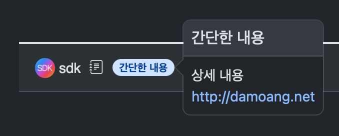

# 회원 메모

다른 회원을 기억하기위해 메모를 작성할 수 있습니다. 글, 댓글 작성자의 이름 옆에 메모가 표시됩니다.

회원메모는 다른 회원과 공유되지 않으며 내 계정으로 로그인한 상태에서만 표시됩니다.

## 메모 추가, 수정

게시판의 글, 댓글 옆에 표시되는 <code><i class="bi bi-journal-text"></i></code> 아이콘이나 회원의 닉네임을 클릭하여 "메모" 메뉴를 선택하여 메모를 추가하거나 수정할 수 있습니다.

 

## 메모 입력화면

새로운 메모를 추가하거나 기존 메모를 수정할 수 있습니다.

- 색상: 메모의 배경색을 선택
- 메모: 글, 댓글 작성자의 닉네임 옆에 표시되는 메모 내용
- 추가 내용: 메모를 마우스 커서를 올리거나 클릭/탭 했을 때 보여지는 상세 내용

"추가 내용" 항목에는 더 많은 내용을 입력할 수 있으며, 주소를 입력해두면 해당 주소로 바로 이동할 수 있는 링크가 생성됩니다.

> [!tip] 링크를 클릭할 수 없다면
> 작성자 닉네임 옆의 메모를 클릭/탭하면 팝업이 고정되어 주소를 클릭할 수 있습니다.

## 메모 관리

<code><i class="bi bi-grid"></i> 마이메뉴</code> 또는 페이지 상단의 <code><i class="bi bi-person-circle"></i></code> 아이콘을 클릭하여 <a href="https://damoang.net/plugin/da_member_memo/public/memo_list.php" target="_blank"><i class="bi bi-journal-text"></i> 메모관리</a>에서 메모를 확인하고 편집할 수 있습니다.

